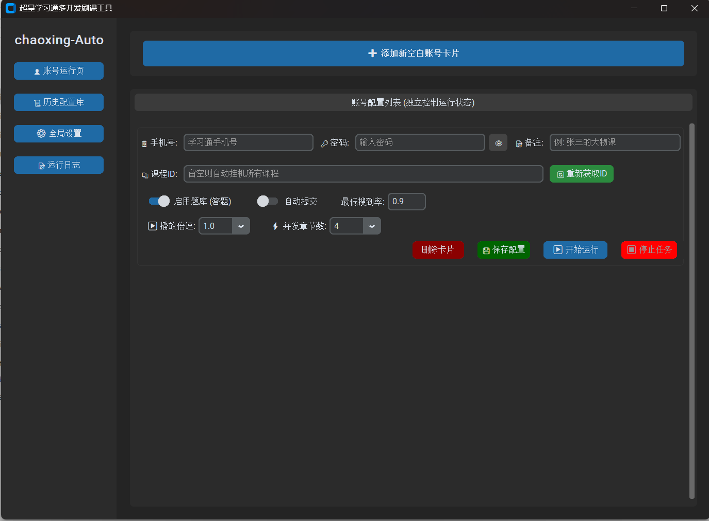

# 🚀 chaoxing-GUI-Helper (学习通网课 GUI 助手)

[](https://www.gnu.org/licenses/gpl-3.0)
[](https://www.python.org/downloads/)

**XuexiTong-GUI-Helper** 是一款专为大学生设计的可视化网课辅助工具。

本项目基于强大的开源核心项目 [Samueli924/chaoxing](https://github.com/Samueli924/chaoxing) 开发，为其添加了直观易用的图形化界面（GUI）。旨在让没有编程基础的同学也能轻松配置并使用自动化脚本，告别繁琐的命令行操作，将精力投入到更有价值的学习和实践中。

> ** 简易运行方式：**
> 如果你没有学习过编程，或者不想折腾 Python 环境，**请直接点击页面右侧的 [Releases] 标签，下载打包好的免安装 `.exe` 压缩包，解压后双击即可直接运行！**

---

## 📸 软件截图



---

## ✨ 功能特性

-   **🖥️ 可视化操作**：纯小白友好的图形化启动器，参数配置一目了然，再也不用手动去改 `config.ini` 配置文件了。
-   **⚙️ 核心功能继承**：完美继承原项目强大的“全自动无人值守”功能，支持视频连播、任务点自动完成等。
-   **⚡ 一键启停**：通过可视化按钮轻松控制脚本的运行状态，支持多账号并发，日志实时在界面输出，运行情况尽在掌握。

---

## 🛠️ 源码安装与运行 (面向开发者)

### 1. 准备工作
请确保你的电脑上已经安装了 **Python 3.13 或更高版本**。

### 2. 克隆仓库
```bash
git clone [https://github.com/GuZhi223/chaoxing-GUI-Helper.git](https://github.com/GuZhi223/chaoxing-GUI-Helper.git)
cd chaoxing-GUI-Helper
```

### 3. 配置底层核心引擎 (⚠️ 重要)
由于本项目是 GUI 启动器，你需要自行下载原作者的核心引擎才能正常工作：
1. 前往 [Samueli924/chaoxing](https://github.com/Samueli924/chaoxing) 下载其源码（或打包好的 `ChaoxingTool.exe`）。
2. 将下载的核心文件（例如 `main.py` 及相关依赖，或 `ChaoxingTool.exe`）放置在本项目的**根目录**下。
3. （可选）如果你使用的是源码运行，请确保将本项目 `gui.pyw` 中的可执行命令修改为 `EXE_COMMAND = ["python", "main.py"]`。

### 4. 安装依赖
安装项目及 GUI 界面所需的第三方库：
```bash
pip install -r requirements.txt
```

### 5. 启动程序
运行主程序，即可打开可视化界面：
```bash
python gui.pyw
```

---

## 🙏 致谢 (Acknowledgments)

本项目的底层自动化核心逻辑完全基于以下优秀的开源项目，向原作者表示最诚挚的感谢与敬意：

* **[Samueli924/chaoxing](https://github.com/Samueli924/chaoxing)**: 超星学习通/超星尔雅/泛雅超星全自动无人值守完成任务点。

---

## ⚠️ 免责声明

**请务必仔细阅读：**

1.  本项目仅供计算机专业同学进行 Python 自动化控制、GUI 开发等技术研究与学习交流。
2.  禁止将本项目用于任何商业用途或提供代刷服务。
3.  用户在下载、安装、使用本项目的过程中，需自行承担相关风险（包括但不限于账号异常、被平台检测等后果）。作者不承担任何因使用本工具而导致的违规责任。
4.  请尊重教育公平，合理利用技术工具。

---

## 🤝 贡献与反馈

如果你有关于界面优化的好想法，或者遇到了 Bug，欢迎提交 **Issue** 或发起 **Pull Request**！喜欢的话别忘了点个 **⭐ Star** 支持一下！
